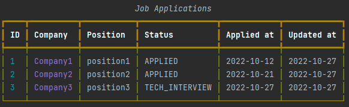

# Track Job Applications (CLI)

Track Job Applications is a CLI app to help
professionals currently applying for jobs, by keeping
a detailed record of all the job openings they have
applied to and provide relevant metrics on them.


> **Refer to the [publish](https://github.com/Aditya-Gupta1/track-job-applications/tree/publish) branch for the current progress of the project along with the updated code and the documentation**.

## Motivation

The question is: **"Why do we even need to track our job applications?"**

We apply to hundreds of job openings when looking out for jobs, and often forget about
them at a later point in time. Since we forget about them, we can't actually analyze
what is going right or wrong in the entire process. 

And actually there's a lot we can do with this data! It can be used to answer questions like:

- In how many companies have I been shortlisted yet?
- What companies rejected my profile?
- In how many companies have I given 2 rounds of tech interviews?
- In how many HR rounds I got rejected?
- How many offers do I have? *Though you won't forget this one :wink:*

And the list goes on.

## Installation

You need to have [Python](https://www.python.org/downloads/) installed on your system as a prerequisite.
If it's already installed, run the following command:

```cmd
pip install track-job-applications
```
[Note: The app is still in development and not published to PyPI yet.]

## Quick Start

```commandline
// add a job application
> track-job add CompanyX SDE-1

// display all the applications
> track-job ls

// update the application details
> track-job update company <application-id> <new company name>

// know more about any command
> track-job <command> --help

// know about all the commands available
> track-job --help

// get a report on all the applications
> track-job report

// get report on all the applications made within a date range
> track-job report <start date in YYYY-MM-DD> <end date in YYYY-MM-DD>
```

> :warning: Since the app is not published yet, you can follow the "[setting up the development environment steps](https://github.com/Aditya-Gupta1/track-job-applications/blob/publish/CONTRIBUTING.md#setting-up-the-development-environment)" and execute the above commands for testing the app functionality.

**Example:**
```commandline
track-job add Company1 position1 2022-10-12 <br>
track-job add Company2 position2 2022-10-21 Applied <br>
track-job add Company3 position3 2022-10-27 "Tech Interview" 
track-job ls
```
**Output:**
<p align="center">

</p>

## Tech Stack


## Contributing

Contributions are always welcome!

See [CONTRIBUTING.md](https://github.com/Aditya-Gupta1/track-job-applications/blob/publish/CONTRIBUTING.md) for ways to get started.

Please adhere to this project's [CODE OF CONDUCT](https://github.com/Aditya-Gupta1/track-job-applications/blob/publish/CODE_OF_CONDUCT.md).
